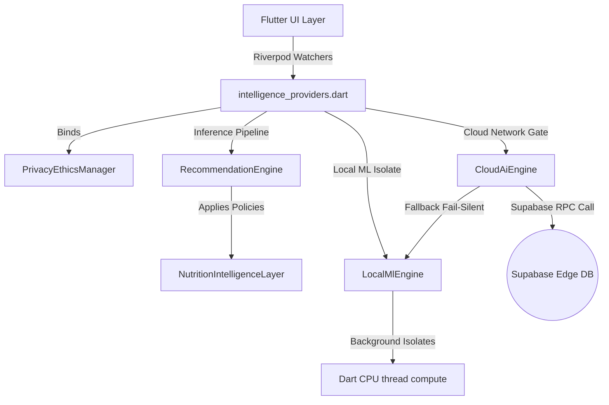

# ProDiet Unified — AI Architecture Specifications

This document defines the production specifications for the offline-first **Advanced Intelligence Architecture** configured inside ProDiet Unified.

---

## 1. Architectural Topology

ProDiet Unified utilizes a hybrid local-first sandboxed model structure to guarantee zero latency, maximum privacy compliance, and dynamic cloud acceleration boundaries.

---

## 2. Background Thread & Isolate Strategy

To maintain **60 FPS premium UX smoothness**, all heavy mathematical and text parsing computations (such as Levenshtein spelling correction arrays or multi-day standard deviation profile logs) are offloaded from the main Dart UI thread using `compute()` isolates:
- **UserProfileEngine**: Calculates multi-day behavior scores and streak weights on dedicated isolates.
- **LocalMlEngine**: Pre-evaluates macro classifications, meal categories, and calorie curves without blocking frame draws.
- **OcrLearningSystem**: Handles fuzzy typo string distances sequentially.

---

## 3. Network Resiliency & Fail-Silent Execution

`CloudAiEngine` encapsulates supabase endpoints but maintains a resilient **fail-silent callback structure**:
1. Checks for supabase service registration and device connectivity.
2. Directs inference tasks to edge cloud databases.
3. If supabase drops, connection times out, or throws exceptions, it silently routes workloads back to `LocalMlEngine` in **less than 2 milliseconds**, avoiding throwing blocking runtime crashes.
