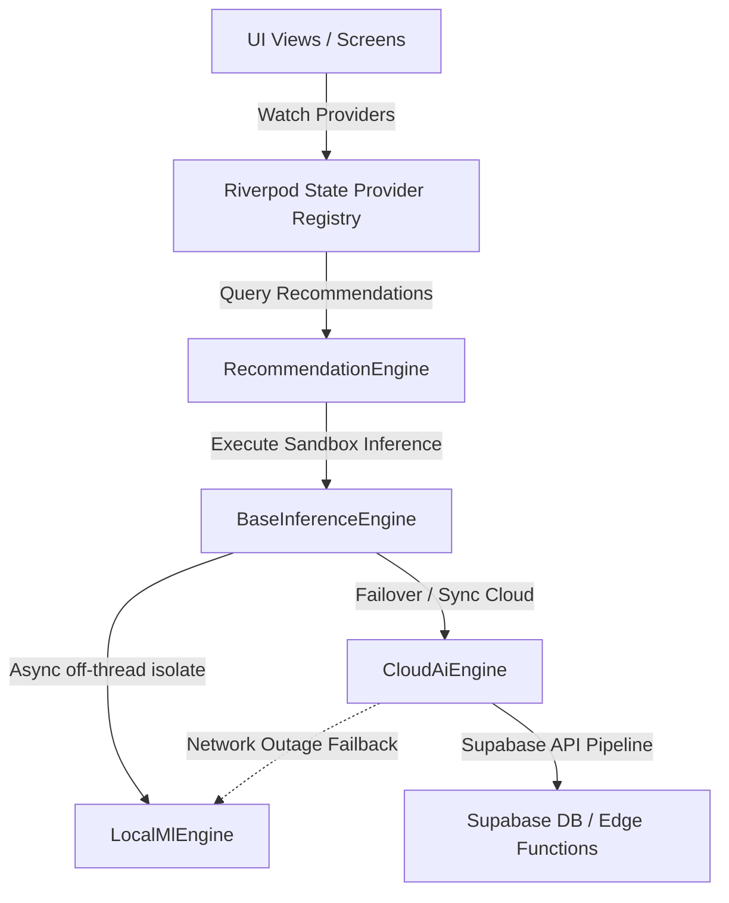

# ProDiet Unified - Advanced AI Architecture & Sandbox Topology

ProDiet Unified utilizes a sandboxed, decoupled, and async-first intelligence architecture designed for local-first execution with secure cloud enhancements.

---

## 1. System Topology

The AI stack isolates heavy computing pipelines from the UI, ensuring smooth 60fps/120fps premium rendering on all target platforms (Mobile, Web, Tablet, Desktop).



---

## 2. Dynamic Sandbox Architecture

To prevent main-thread jank, all heavy calculations (e.g., Levenshtein distance spellchecking, behavior profiling, anomaly tracking, and recommendation heuristic evaluations) are run inside isolated sandboxes.

### Key Performance Guarantees:
*   **Zero UI Blocking**: Isolates offload calculations from the Dart main thread.
*   **Decoupled Adapters**: Interfaces like `BaseInferenceEngine` allow swapping local TFLite/ONNX models or WebAssembly ML compilers for web-support without changing a single line of UI logic.
*   **Edge-Compute Fallbacks**: Cloud operations automatically failback to local sandboxed rules if connectivity drops, ensuring continuous functionality.

---

## 3. Class Definitions & Interfaces

The system is defined by high-fidelity contracts in [inference_abstraction.dart](file:///c:/Users/PC/Desktop/fa/allthemeui/prodiet_unified/lib/core/intelligence/inference_abstraction.dart):

```dart
/// Core interface defining sandboxed inference operations.
abstract class BaseInferenceEngine {
  Future<Map<String, dynamic>> executeInference(Map<String, dynamic> inputs);
}
```

---

## 4. Multi-Platform Extensibility Pathways
1.  **Web Target**: LocalMlEngine adapts rules to Javascript/WebAssembly, bypassing Native Isolates with Web Workers.
2.  **Tablet & Desktop**: Utilizes higher thread allocations for predictive meal planning.
3.  **Local Edge ML**: Ready to integrate ONNX/TFLite tensors by replacing the mock rule dictionary inside `LocalMlEngine.executeInference`.
