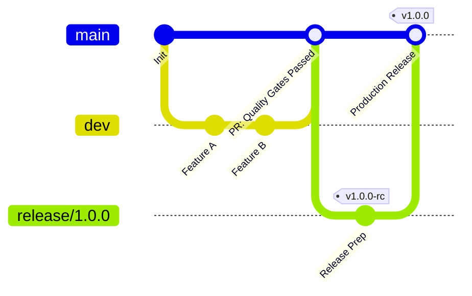

# ProDiet Unified — Automated Engineering & Quality Infrastructure

ProDiet Unified utilizes a fully automated testing, deployment, and infrastructure-as-code orchestration stack. This ensures rapid iteration cycles without compromising architectural safety or security policies.

---

## 1. Multi-Dimensional Quality Gates

We enforce distinct quality gates that every pull request must pass prior to merging into primary branches:

| Gate | Automated Tool | Verification Target | Failure Threshold |
| :--- | :--- | :--- | :--- |
| **Formatting** | `dart format --set-exit-if-changed .` | Style guide compliance and clean file structures. | Any unformatted file. |
| **Static Analysis** | `flutter analyze` | Strict type safety, compiler warnings, lint conventions. | Any compiler warning, info, or error. |
| **Unit Verification** | `flutter test test/unit/` | Pure business rules, domain serialization, utilities. | Any single assertion failure. |
| **State Pipeline** | `flutter test test/providers/` | Riverpod Mutator reactions and state transitions. | Any unhandled notifier error. |
| **Widget Constraints** | `flutter test test/widgets/` | Accessibility limits, dark/light theme, and layout clips. | Missing loading or error widget states. |
| **End-to-End E2E** | `flutter test test/integration/` | Multi-step active user journeys (Login to Logout). | Session leakage or failure to purge credentials. |
| **Sync Resilience** | `flutter test test/sync/` | Debounce timers, conflict resolution, outbox retries. | Data loss or unhandled queue collisions. |

---

## 2. Infrastructure as Code (IaC) & State Architecture

Database and environment configurations are managed programmatically:

### Drift Local Database (Client-Side IaC)
*   **Idempotent Migrations**: Drift schema upgrades are versioned and tested to preserve local data integrity when transitioning schemas.
*   **Reactive Outbox triggers**: Insertions into database tables trigger background sync notifications via reactive stream listeners.

### Supabase Schema & Security Policies (Backend IaC)
*   **Version-Controlled Schemas**: All table definitions, functions, and database triggers are checked into the repository under the `supabase/` directory.
*   **RLS-as-Code**: Row Level Security (RLS) policies are defined programmatically as part of database migration scripts. This guarantees that user authentication is enforced at the database engine level.

### Configuration Management
*   **Unified `.env.json`**: Client-side secrets, Supabase endpoints, and Gemini API keys are consolidated in a unified, version-controlled JSON structure. The automated validation script verifies this file on every local or remote build.

---

## 3. Automated Delivery & Release Pipeline

The branching and tag strategy governs our delivery lifecycle:

### Build & Release Lifecycle Stages
1.  **Branch Protection**: Direct pushes to `main`, `master`, and `release/*` are disabled. All changes require a Pull Request that compiles cleanly and passes the test suite.
2.  **Release Candidate Tag (`v*-rc`)**: Triggers an automated build uploaded directly to Google Play Internal Testing or Apple TestFlight for QA verification.
3.  **Production Tag (`v*`)**: Initiates compilation of a production-signed Android App Bundle (AAB) and iOS build, uploading code coverage metrics to GitHub Releases.

---

## 4. Maintenance & Operations

ProDiet Unified utilizes active runtime diagnostics to maintain health:

*   **Dependabot Audits**: Weekly Dependabot scans verify that libraries, plugins, and dependencies do not contain critical CVE security vulnerabilities.
*   **Observability via Crashlytics**: Any runtime exception caught in production triggers immediate logging to Firebase Crashlytics.
*   **Structured Analytics Taxonomy**: App lifecycle states, network syncs, and scanning failures map to a unified taxonomy (e.g., `auth.login.success`, `sync.failed`). This feeds into Firebase Analytics for real-time conversion monitoring.
