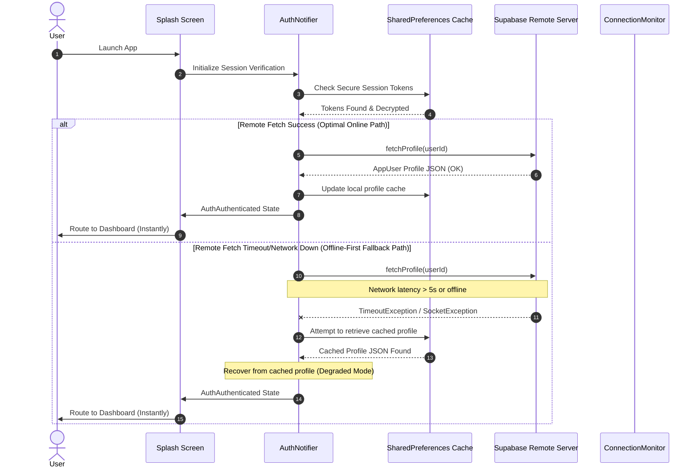

# Bootstrap Network Trace

This document maps the runtime trace, timing constraints, and sequential operations executed across the network and local caching sub-systems during the **ProDiet Unified** initialization sequence.

---

## 1. Startup Network Timeline

The following timeline details the maximum allowable thresholds, typical response times, and failure behavior of each step in the bootstrap flow.

| Phase | System / Component | Primary Action | Medium | Target Duration | Timeout Limit | Error/Fallback Handling |
| :--- | :--- | :--- | :--- | :--- | :--- | :--- |
| **1** | `SecureSupabaseStorage` | Restore stored access tokens from hardware keychain | Local Disk | 15ms | None | Empty session / Redirect to Login |
| **2** | `ConnectionMonitor` | Perform host-reachability checks (HTTP 204 ping) | Remote Network | 300ms | 3,000ms | Degraded Mode triggered |
| **3** | `AuthNotifier` | Remote lookup of user profile table in Supabase | Remote API | 1,200ms | 5,000ms | Failover to local `SharedPreferences` cache |
| **4** | `Drift` / Local Cache | Synchronize local schema and prepare Drift queries | Local DB | 50ms | None | Immediate local degraded recovery |
| **5** | `FCM / Push Notification` | Initialize cloud messaging push notifications | Remote Network | 800ms | None | Log warning; run gracefully degraded |

---

## 2. Boot Flow Sequence Diagram

This sequence diagram illustrates the robust boot paths: the ideal online flow, the resilient network failure/timeout path, and the cached fallback path.

---

## 3. Latency Mitigation Best Practices

To prevent UI freezes and ensure consistent performance across all platforms (iOS, Android, Web), the bootstrap network layer adheres to the following timing rules:
1. **Never block the UI Thread:** All remote operations run asynchronously using `Future` objects.
2. **Aggressive Failover Timeouts:** Remote profile resolution is capped at exactly **5 seconds** to ensure users drop into offline/degraded mode quickly rather than hanging indefinitely.
3. **Double-buffered Initialization Timer:** The splash screen's timeout safety buffer is set to **20 seconds** to allow sufficient retry handshakes under very poor cellular networks before displaying warning UI options.
