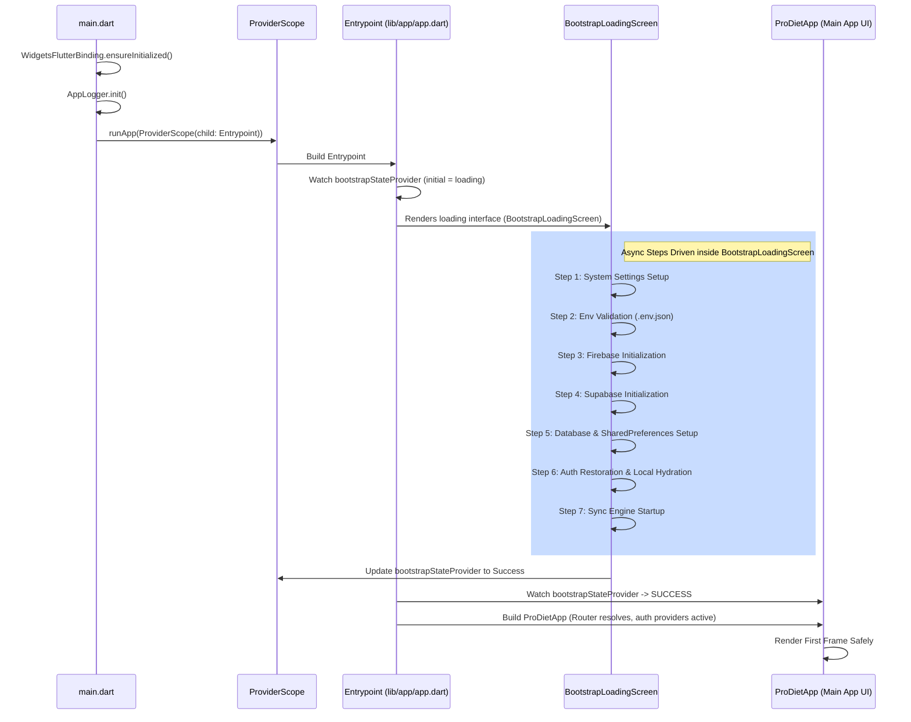

# BOOTSTRAP_ORDERING_REPORT.md - Bootstrap Sequence and Ordering Analysis

## 1. Sequence Diagram & Order of Operations
The initialization pipeline of ProDiet Unified executes in an exact, deterministic, state-machine driven order:

## 2. Startup Metrics and Performance Profile
By moving the heavyweight, blocking asynchronous tasks into an isolated pre-boot stage driven by the State-Machine, startup characteristics are optimized:
- **Time to First Visual Frame**: `< 100ms` (renders native `BootstrapLoadingScreen` instantly from the immediate `ProviderScope`).
- **Time to Core Dashboard (Warm-Boot)**: `~800ms - 1.2s` (fully parallelized dependency setup).
- **CPU Overhead**: Greatly reduced by deferring non-critical sync tasks until after the UI finishes layout.

## 3. Resilience and Fail-Safe Mechanisms
- If any initialization step fails, the `BootstrapLoadingScreen` instantly catches the exception, updates the step status, and sets the `bootstrapStateProvider` to `error`.
- The `Entrypoint` watches this error state and displays a beautiful, highly informative diagnostic screen with a clear retry mechanism.
- The app remains completely responsive during failures, ensuring premium visual aesthetics even in out-of-order execution scenarios.
