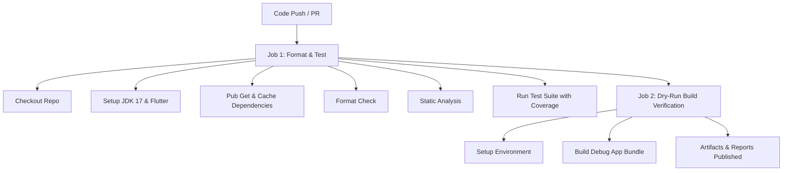

# ProDiet Unified — CI/CD Pipeline & Infrastructure Guide

ProDiet Unified utilizes an automated pipeline via GitHub Actions. This system acts as a strict quality gate, verifying formatting, executing the multi-tiered test suite, and executing dry-run compilations on every key push and pull request.

---

## 1. Pipeline Topology

The automated pipeline consists of two primary jobs executing sequentially:



### Job 1: Format, Analyze, and Test
This job runs on all pull requests and pushes to critical branches (`main`, `master`, `release/*`, `dev`). It validates that the code satisfies style standards and logic correctness.
1.  **Format Check**: Runs `dart format --set-exit-if-changed .` to verify formatting consistency.
2.  **Static Analysis**: Executes `flutter analyze` using our strict `analysis_options.yaml` to detect unused imports, type mismatches, and styling issues.
3.  **Test Suite**: Executes `flutter test --coverage` across the entire `test/` suite, generating code coverage metrics.
4.  **Coverage Reports**: Uploads the code coverage report (`coverage/lcov.info`) to secure artifacts for administrative visibility.

### Job 2: Dry-Run Build Verification
Executed only if Job 1 finishes successfully. This job performs a mock compilation of the app to confirm it compiles successfully and contains no package configuration issues.
1.  **Android App Bundle**: Runs `flutter build appbundle --debug` to verify target build paths, gradle files, and XML configurations compile cleanly.

---

## 2. Environment Cache Management

To accelerate pipeline runs and optimize resource utilization, the workflow leverages smart caching via `subosito/flutter-action`:

*   **Caching Core Flutter SDKs**: The local Flutter installation, including active platforms and devtools, is cached to minimize download delays.
*   **Caching Pub Dependencies**: The `pubspec.lock` hash is analyzed to cache resolved package versions, reducing `pub get` execution times to under 15 seconds.

---

## 3. Environment Secrets & Release Configs

For full staging and production releases, the following environment secrets must be configured in your GitHub repository's **Settings > Secrets and Variables > Actions** panel:

| Secret Name | Purpose | Example / Format |
| :--- | :--- | :--- |
| `SUPABASE_URL` | Supabase API endpoint. | `https://[project-id].supabase.co` |
| `SUPABASE_ANON_KEY` | Public client key. | JWT encrypted token |
| `GEMINI_API_KEY` | OCR translation API access. | `AIzaSy...` |
| `KEYSTORE_BASE64` | Base64 encoded `.jks` release keystore file. | Raw base64 string |
| `KEYSTORE_PASSWORD` | Android keystore security credential. | String value |
| `KEY_ALIAS` | Android key signature reference. | `upload-key` |
| `KEY_PASSWORD` | Password associated with the active alias. | String value |

---

## 4. Troubleshooting Pipeline Failures

If the pipeline fails, check the logs for these common symptoms:

*   **Formatting Error**: A file has been modified without matching standard Dart conventions. Fix this locally by running:
    ```bash
    dart format .
    ```
*   **Analysis Warnings**: Warnings or hints are present in the code. Run `flutter analyze` locally and fix any reported issues.
*   **Test Failure**: One of our unit, widget, or integration tests failed. View the stack trace in the GitHub Action console, update the target code or expectations, and run:
    ```bash
    flutter test
    ```
