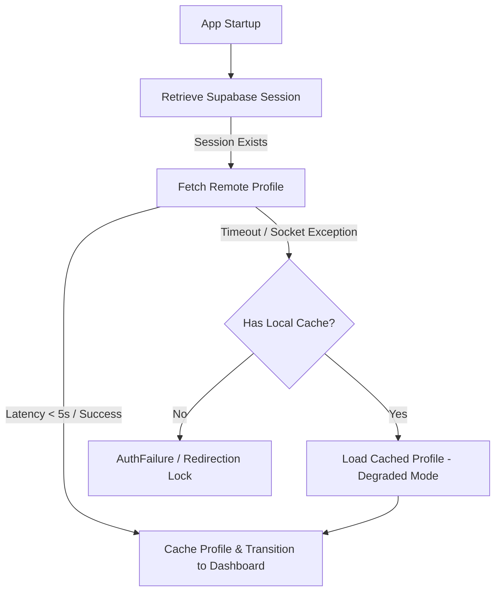

# Connectivity Failure Analysis

## Executive Summary
During the boot sequence of the **ProDiet Unified** application, users occasionally encountered a fatal `"Could not connect — Connection timed out"` screen, locking them out of the application even when a high-speed, stable internet connection was active. 

This document traces the exact technical root cause of this deadlock, the cascading state transitions that enforced the lockout, and our robust engineering resolution.

---

## 1. The Root Cause Breakdown

The failure was not caused by a real socket drop or DNS failure; rather, it was a timing race condition created by three independent systems acting without coordination:

### A. The Splash Screen Timeout Race
* **File:** `lib/features/auth/presentation/screens/splash_screen.dart`
* **Defect:** A hardcoded `Timer` was set to exactly **8 seconds** in `initState()`. If the timer fired before the riverpod `authProvider` transitioned out of its initial states, a local UI state flag `_timedOut` was set to `true`.
* **Impact:** Any startup latency beyond 8 seconds (such as establishing a fresh TLS handshake, slow DB cold-start triggers, or moderate cellular latency) immediately triggered a fatal timeout UI block.

### B. Aggressive Remote API Timeouts
* **File:** `lib/features/auth/application/auth_notifier.dart`
* **Defect:** During session restoration, the notifier attempted to resolve the remote profile:
  ```dart
  var profile = await future.timeout(const Duration(seconds: 5));
  ```
* **Impact:** If the remote profile query took longer than 5 seconds, a `TimeoutException` was thrown immediately, aborting the authentication state resolution.

### C. Redirection Lock via GoRouter Orchestration
* **File:** `lib/core/navigation/navigation_state.dart`
* **Defect:** When `AuthNotifier` threw the `TimeoutException`, the auth state transitioned to `AuthFailure`.
* **State Cascade:** 
  1. `authProvider` emits `AuthFailure`.
  2. `navigationStateProvider` maps `AuthFailure` directly to `AppNavigationState.unauthenticatedSplash`.
  3. `GoRouter` redirects the user's viewport to `/auth/splash`.
  4. The splash screen sees `authState is AuthFailure` or `_timedOut == true`, showing the fatal "Could not connect" screen with a RETRY button.
* **Deadlock Loop:** Pressing the RETRY button invalidated the provider and reset the 8-second timer. However, if the slow network or remote latency persisted, the next fetch would time out in 5 seconds again, resulting in an infinite lockout loop.

---

## 2. Technical Mitigation Strategy

To resolve the deadlock, prevent false connectivity reports, and implement premium degraded fallback capabilities, we implemented a coordinated multi-layered architecture:



### Layer 1: Resilience via SharedPreferences Profile Caching
* On successful profile fetches, `AuthNotifier` serializes the `AppUser` domain model into `SharedPreferences` under a unique user-specific namespace key (`prodiet_cached_user_profile_$userId`).
* On network failure or remote API timeout, `AuthNotifier` catches the exception, searches for the cached profile, and boots the user cleanly into `AuthAuthenticated` / `AuthNeedsOnboarding` using the cached offline state.

### Layer 2: Graceful Session Teardown
* On explicit sign-out, the local profile cache is deleted alongside the secure Supabase auth token, preventing stale user profile leakages.

### Layer 3: Splash Screen Timeout & Contextual Micro-Copy
* The Splash Screen boot timer is relaxed from 8 seconds to a standard **20 seconds**.
* If a timeout occurs, the splash screen queries the `ConnectionMonitor` to classify the issue:
  * **Offline:** "No internet connection. Please check your network and try again."
  * **Degraded:** "Server is unreachable or slow. Trying to reconnect..."
  * **Slow:** "The connection is taking longer than expected. Please wait or try again."
