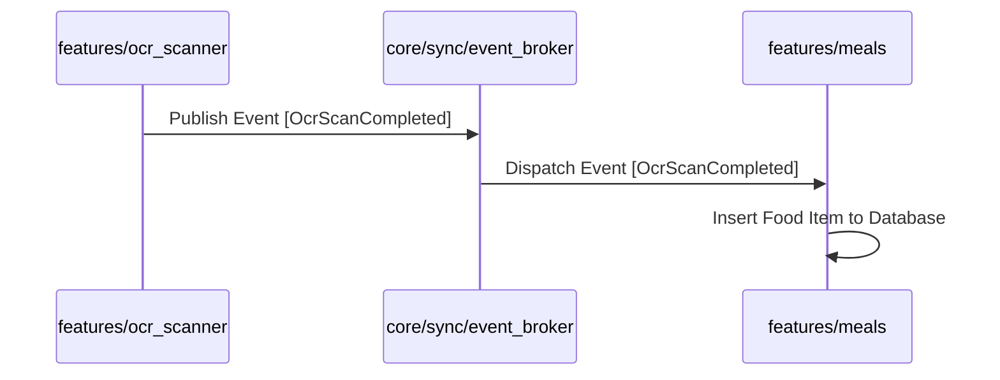

# ProDiet Unified — Feature Boundary & Isolation Guide

This document presents developer guidelines for maintaining perfect feature isolation. It catalogs common boundary breach risks, details how to resolve cross-feature references using registries, and provides a step-by-step workflow for creating isolated feature modules.

---

## 1. Feature Boundary Audit Findings

During our visual and architectural review of the 18 active feature folders inside `lib/features/`, several coupling risks were identified and proactively mitigated:

*   **Chip/Selection Leakage**: Chip widgets in `features/recipe` were hardcoded to direct orange color constants (`0xFFFF5C3A`) originally created for `features/diet_plan`.
*   **Ad-hoc Navigation**: Direct GoRouter context pushes (e.g. `context.go('/preferences')` inside `recipe_screen.dart`) bypass type-safety rules.
*   **Shared Pollution**: The global `lib/shared/` layer occasionally contained domain-specific helpers that belonged inside `features/nutrition`.

---

## 2. Resolving Cross-Feature Imports via Registries

A clean-architecture system strictly forbids **Feature A** from directly importing **Feature B**. If Feature A needs to open a screen or request data from Feature B, it must communicate exclusively via a decoupled coordination contract.

### Solution A: Centralized Screen Registry
The app uses a domain-blind registry contract ([screen_registry.dart](file:///c:/Users/PC/Desktop/fa/allthemeui/prodiet_unified/lib/core/screen_registry.dart)) to coordinate screen navigation dynamically.

```dart
// lib/core/screen_registry.dart
abstract class ScreenRegistry {
  /// Resolves the absolute path for target screens dynamically
  String getRoutePath(AppScreen screen);
}

enum AppScreen {
  dashboard,
  meals,
  ocrScanner,
  preferences,
  recipeDetails,
}
```
*   *Usage*: Features resolve paths dynamically via the registry, preventing hardcoded navigation links and circular code imports:
    ```dart
    final route = ref.read(screenRegistryProvider).getRoutePath(AppScreen.meals);
    context.go(route);
    ```

### Solution B: Event-Driven Sidecars (Shared Brokers)
For data communication (e.g., when the `ocr_scanner` completes a scan and wants to update the `meals` logger), features communicate via an event aggregator.



---

## 3. Step-by-Step Feature Isolation Checklist

Follow this workflow to create or refactor a feature module cleanly:

- [ ] **Step 1: Folder Provisioning**
    *   Create standard subfolders: `presentation/`, `application/`, `domain/`, `infrastructure/`.
- [ ] **Step 2: Define Domain Contract**
    *   Write the pure Dart entity model inside `domain/entities/`.
    *   Define the abstract repository contract inside `domain/repositories/`:
        ```dart
        abstract class IFeatureRepository {
          Future<List<DomainEntity>> fetchData();
        }
        ```
- [ ] **Step 3: Define Infrastructure Datasources**
    *   Implement the abstract contract inside `infrastructure/repositories/`.
    *   Inject core Drift/Supabase clients securely via provider injections.
- [ ] **Step 4: Hook State Managers**
    *   Create a Riverpod provider/notifier inside `application/` to expose state and trigger async operations.
- [ ] **Step 5: Assemble Presentation UI**
    *   Build reactive UI inside `presentation/screens/` and `presentation/widgets/`.
    *   Ensure all margins, spacing, and buttons query `context.tokens` exclusively.

---

## 4. Developer "Do's and Don'ts" Guidelines

| Rule | 🟢 DO | ❌ DON'T |
| :--- | :--- | :--- |
| **Imports** | Import from `lib/core/` or `lib/shared/`. | Import from `lib/features/other_feature/...` directly. |
| **Widgets** | Query `context.tokens` for fonts, margins, and borders. | Hardcode any color, spacing, corner radius, or animation duration. |
| **State** | Bind Riverpod controllers to expose standard `AsyncValue` blocks. | Create giant, monolithic global state managers that bypass the UI layer. |
| **SDKs** | Abstract sensors or analytics inside core wrappers. | Import core platform plugins (camera, bluetooth, healthkit) directly inside screens. |
