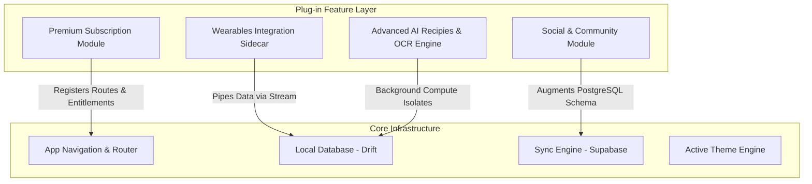

# LONG-TERM SCALABILITY ARCHITECTURE REPORT

This report establishes the long-term technical architecture and architectural guidelines for ProDiet Unified to scale to millions of active users. It outlines the strategic roadmap for premium subscriptions, community/social modules, advanced telemetry sync, machine learning/AI intelligence, and performance safety boundaries.

---

## 1. Modular Expansion Architecture

ProDiet Unified will employ a plugin-safe architectural style. The core application remains lightweight and unpolluted by feature-specific logic, while advanced capabilities are introduced as self-contained feature modules that register themselves with central registries.



---

## 2. Advanced Feature Roadmap & Architecture Plans

### A. Premium Subscriptions & Entitlements
* **Architecture**: Implement a secure, server-authoritative entitlement verification gateway using **RevenueCat** or **Stripe Edge Functions**.
* **Key Contracts**:
  * Define `EntitlementService` that exposes streams of active user tiers (`free`, `premium`, `coach`).
  * Integrate entitlement-guarded route filters directly in `lib/app/router.dart` redirect logic, blocking premium routes at the framework level before widget rendering.
  * Local caching: Entitlement status is cached in secure storage (`FlutterSecureStorage`) with cryptographic verification to enable offline operation.

### B. Social & Community Engine
* **Architecture**: Establish a decoupled feed architecture using event-driven microservices.
* **Database Design**:
  * Separate community read-models to prevent user queries from competing with critical transaction databases (`meals`, `water_logs`).
  * Introduce an append-only `social_feed_activities` table with PostgreSQL partition indexes based on user geography and activity timestamp.
  * Utilize Supabase Realtime channels with RLS security policies to stream likes, comments, and milestones.

### C. Wearables & Telemetry Sidecar
* **Architecture**: Extract and generalize telemetry fetching beyond standard mobile SDKs.
* **Strategy**:
  * Build a unified `TelemetrySyncService` that abstracts Apple HealthKit, Google Fit/Health Connect, Garmin, and Fitbit.
  * Employ an isolated background worker (`Workmanager`) that runs periodically (every 15–30 minutes) to query health datastores without impacting foreground app performance.
  * Data reconciliation: Duplicate data points are filtered using UUID hashes generated from source metadata before syncing to Supabase.

### D. Advanced AI & Machine Learning Pipeline
* **Architecture**: Establish a hybrid local/cloud inference model.
  * **On-Device (TensorFlow Lite / ONNX)**: Performs real-time OCR text-cleanup and local calorie estimation using small, efficient neural models running on mobile hardware.
  * **Cloud-Edge (Gemini / Supabase Edge Functions)**: Handles complex generative tasks, such as creating dynamic, personalized recipe plans from current pantry inventory.
* **Safety Abstractions**: All heavy calculations run inside Dart `Isolates` to prevent UI thread frame drops.

### E. Multi-Device Real-Time Sync
* **Architecture**: Upgrade the sync engine to a conflict-free replicated data type (CRDT) model.
* **Strategy**:
  * Implement logical clocks (e.g., hybrid logical clocks) to resolve update-conflicts across multiple active user sessions (e.g., tablet, web, phone active simultaneously).
  * Data updates operate as append-only log entries rather than direct cell overwrites, allowing mathematical reconstruction of the perfect chronological state during synchronization.

---

## 3. Performance Safety & Framework Protections

To accommodate exponential growth without visual degradations or frame rate drops, ProDiet Unified implements three safety fences:

### 1. Provider Graph Protection (Riverpod Safety)
* **Rule**: Prevent global cascade rebuilds. Global providers must never trigger the reconstruction of entire sub-trees when small, unrelated values change.
* **Practice**:
  * Use `.select` operators aggressively on all consumers:
    ```dart
    // Good: Rebuilds ONLY when the protein target changes
    final proteinTarget = ref.watch(dietPlanProvider.select((p) => p.macroTarget.protein));
    ```
  * Enforce `.autoDispose` on all screen-scoped providers to completely release database stream subscriptions and UI memory when navigation shifts away.

### 2. Eventual-Consistency & Resilient Outbox Caching
* **Rule**: Design all database updates to operate offline-first using a transactional local database outbox.
* **Practice**:
  * Core tables (`meals`, `water_logs`) write immediately to Drift.
  * An isolated sync daemon monitors the `sync_outbox` table, uploading queued entities using exponential backoff with jitter during network outages.
  * API calls never block user navigation; the user is immediately shown a success state, and the network sync handles transport silently.

### 3. Progressive SQLite / PostgreSQL Indexing
* **PostgreSQL Schema Optimization**:
  * Index fields targeted by analytical queries (`user_id`, `logged_at`, `nutrient_type`).
  * Implement standard vacuuming routines and database read-replicas for large-scale corporate telemetry queries.

---

## 4. Scalability Metrics & Thresholds

To maintain architectural transparency, ProDiet Unified defines concrete performance budgets that must be audited:

| Component | Target Metric (Budget) | Failure Threshold | Action on Breach |
| :--- | :--- | :--- | :--- |
| **Startup Time** | `< 1200ms` | `> 2500ms` | Delay lazy-loaded module registrations; refactor initialization blockers out of `bootstrap.dart`. |
| **Database Query**| `< 16ms` (1 frame) | `> 50ms` | Introduce composite indices on compound fields; partition table by month. |
| **Outbox Queue** | `Immediate local write` | `Blocks UI Thread` | Move SQLite write transaction to a Drift background worker thread. |
| **UI Frame Rate** | `120 fps` (smooth) | `< 90 fps` | Audit widget tree using Flutter Performance DevTools; apply `const` constructor keywords. |

---

> [!TIP]
> Architectural contracts for local isolates and remote AI calls are defined inside [inference_abstraction.dart](file:///c:/Users/PC/Desktop/fa/allthemeui/prodiet_unified/lib/core/intelligence/inference_abstraction.dart) and [analytics_intelligence.dart](file:///c:/Users/PC/Desktop/fa/allthemeui/prodiet_unified/lib/core/intelligence/analytics_intelligence.dart), serving as clean code models for incoming features.
