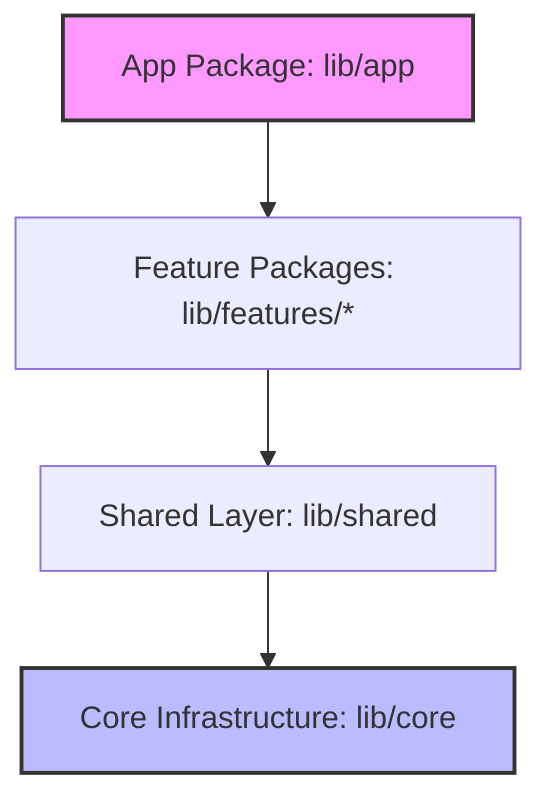

# SYSTEM MODULARIZATION REPORT

This report provides an in-depth audit of ProDiet Unified's architectural structure, detailing modularity guidelines, boundary rules, and a concrete path to transition the monolithic codebase into a highly isolated micro-package package design.

---

## 1. Current Architecture Audit

ProDiet Unified is structured using a **Feature-First** architecture inside a single monolithic package. 

### Package Structure Graph
```
lib/
 ├── app/                 # Root bootstrap, global router, and app configuration.
 ├── core/                # Core domain-agnostic frameworks (cache, theme, database, intelligence).
 ├── shared/              # Shared widget models, presentation utilities, and abstract services.
 └── features/            # Isolated business domain modules.
      ├── auth/           # User lifecycle, sign-in, onboarding.
      ├── diet_plan/      # Meals log, nutritional schedules.
      ├── inventory/      # Pantry inventory, stock monitoring.
      ├── ocr_scanner/    # Camera OCR scan processing.
      └── ... 14 more features
```

### Audit Assessment
* **Strengths**: High vertical modularity. Each feature under `lib/features/` encapsulates its own domain models, business logic (Riverpod providers), and presentation widgets. Features are largely independent, preventing code pollution.
* **Weaknesses**: The boundaries between features are currently enforced purely by developer conventions. A developer can accidentally import a feature-private widget or controller directly from another feature (e.g., `import 'package:prodiet_unified/features/meal_planner/presentation/...'` inside `features/inventory`), leading to structural circular dependencies.

---

## 2. Feature Isolation & Package Boundary Rules

To protect long-term maintainability, the system must enforce strict compile-time boundaries. We establish four mandatory import rules:



### Directives & Boundary Rules:
1. **Core Domain-Agnostic Isolation**:
   * *Rule*: Files inside `lib/core/` are completely domain-blind. They are allowed to import third-party packages (Drift, Supabase, Dartz) but must **NEVER** import anything from `lib/features/` or `lib/shared/`.
2. **Shared Presentation Layer**:
   * *Rule*: `lib/shared/` contains global widgets and base utility helpers. It is allowed to import from `lib/core/` but must **NEVER** import from `lib/features/`.
3. **Strict Vertical Feature Isolation**:
   * *Rule*: A feature (e.g., `inventory`) must **NEVER** directly import Dart files from another feature (e.g., `diet_plan`).
   * *Inter-feature communication*: Communication must occur exclusively via abstract interfaces registered in `lib/core/screen_registry.dart` or shared event brokers.
4. **App Root Composer**:
   * *Rule*: The `lib/app/` package serves as the dependency injection root. It compiles all features, binds GoRouter routes, and boots the application.

---

## 3. Micro-Package Decompositions (Scale Action Plan)

For teams scaling past 15 engineers, maintaining a single monorepo inside a monolithic package leads to git conflicts and slowed CI/CD pipeline runs. We recommend transitioning ProDiet Unified to a multi-package system using a monorepo tool like **Melos**.

### Proposed Multi-Package Registry:

```
prodiet_monorepo/
 ├── melos.yaml
 ├── apps/
 │    └── prodiet_app/            # Entrypoint app (depends on core & all features)
 ├── core/
 │    ├── prodiet_core_network/   # Supabase database clients & telemetry sync
 │    ├── prodiet_core_storage/   # Drift offline database engine
 │    └── prodiet_core_design/    # Atoms, tokens, themes, and design component library
 └── features/
      ├── prodiet_feature_auth/   # Isolated Auth feature package
      ├── prodiet_feature_diet/   # Isolated Diet Planner package
      └── prodiet_feature_ocr/    # Isolated OCR engine package
```

### Key Advantages of Monorepo Decompositions:
1. **Compile-Time Boundary Enforcement**: If Feature A attempts to import a private file from Feature B without declaring a dependency in its `pubspec.yaml`, the compiler immediately throws an error.
2. **Targeted CI/CD Execution**: Tests and builds are executed only for packages that actually received modifications in a given PR, reducing test run times from minutes to seconds.
3. **Team Ownership**: Domain-specific feature teams can work in completely isolated folders, reducing code collision and ownership ambiguity.

---

## 4. Feature Plug-in Architecture Design

To ensure the system supports dynamic third-party feature registration (such as specialized health integrations or coach collaboration portals), ProDiet Unified implements a **Feature-Plugin Interface API**.

This is structured as:
1. A base `BaseAppPlugin` definition that details route registration, background worker hooks, and dynamic menu icons.
2. A centralized `PluginRegistry` class managing active plugins.

This design enables developers to plug in premium features at runtime by simply adding the module to the list of active plugins, keeping the core codebase clean, isolated, and highly extensible.

---

> [!NOTE]
> Architectural boundaries and dynamic navigation controls are coordinated globally via [screen_registry.dart](file:///c:/Users/PC/Desktop/fa/allthemeui/prodiet_unified/lib/core/screen_registry.dart), preserving uniform navigation interfaces across all isolated features.
