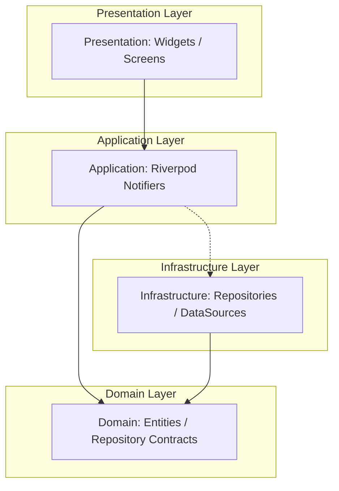

# ProDiet Unified — System Module Architecture

This document defines the official **Clean Feature-First & Shared Core Architecture** for ProDiet Unified. It establishes directory mappings, system layer boundaries, and structural rules designed to prevent dependency erosion as the codebase and engineering teams scale.

---

## 1. Directory Structure Mappings

ProDiet Unified is organized into three primary high-level namespaces: `app/`, `features/`, and `core/`.

```
lib/
 ├── app/                    # Dependency Injection root and bootstrapping layer
 ├── core/                   # Domain-blind infrastructure layer
 └── features/               # Cohesive vertical business domain features
```

### A. Shared Core Layer (`core/`)
The `core/` directory contains all domain-blind capabilities that support multiple features. Under no circumstances should any file under `lib/core/` import a file from `lib/features/`.

| Sub-Folder | Purpose & Primary Responsibilities |
| :--- | :--- |
| **`networking/`** | Supabase client setup, HTTP configurations, and remote API interceptors. |
| **`logging/`** | Centralized logger utilities, telemetry logs, and crash metrics pipelines. |
| **`sync/`** | Outbox synchronizer, offline coordination, and real-time listeners. |
| **`analytics/`** | Event registries, taxonomy definitions, and tracker services. |
| **`theme/`** | HSL dynamic tokens, font loaders, and adaptive theme managers. |
| **`database/`** | Drift local SQLite databases, transaction layers, and migrators. |
| **`routing/`** | GoRouter definitions, URL path processors, and deep-link handlers. |
| **`errors/`** | Domain-blind exceptions, system failure states, and error boundary states. |
| **`utils/`** | Math extensions, parsing helpers, and simple platform validators. |
| **`services/`** | Local secure storage wrappers, secure network caching, and background workers. |

### B. Clean Feature Modules (`features/`)
Each vertical business capability exists under `lib/features/`. A standard feature module is subdivided into four clean-architecture layers:

```
lib/features/[feature_name]/
 ├── presentation/           # View widgets, controllers, and localized themes
 ├── application/            # State management, Riverpod providers, and UseCases
 ├── domain/                 # Entity models, value objects, and repository interfaces
 └── infrastructure/         # Local DB datasources, API callers, and repository implementations
```

*   **`presentation/`**: Screens, panels, adaptive layouts, inputs, and animations. Strictly reactive; contains zero business logic.
*   **`application/`**: Manages view state by exposing Riverpod Notifiers and orchestrating domain UseCases.
*   **`domain/`**: Pure Dart layer containing the business logic rules, domain entities, and abstract repository contracts.
*   **`infrastructure/`**: The concrete data implementations. Converts raw database cells or API JSON to/from domain entities.

---

## 2. Decoupling & Modular Graph

To guarantee that features can be added, refactored, or extracted without causing domino failures, features must remain strictly isolated. 



### Dependency Flow Matrix

1.  **UI widgets** (`presentation`) depend directly on Riverpod controllers (`application`).
2.  **Application controllers** (`application`) interact with the domain model and repositories using abstract contracts (`domain`).
3.  **Data mapping repositories** (`infrastructure`) implement those abstract contracts (`domain`), injecting database or network clients from the `core/` layer.

---

## 3. Modular Feature Registry

To allow the App Shell (`lib/app/`) to assemble screen flows dynamically without hardcoding cross-feature linkages, we implement a decoupled registration contract:

```dart
abstract class FeatureModule {
  String get name;
  
  /// Registers GoRouter routes for this specific feature module
  List<RouteBase> registerRoutes();
  
  /// Registers background synchronization jobs or observers on startup
  void initialize(ProviderContainer container);
}
```

This registry enables developers to add or disable features in `main.dart` by simply appending or removing the module wrapper from the bootstrap array, preserving premium visual and functional quality while maintaining absolute structure isolation.
