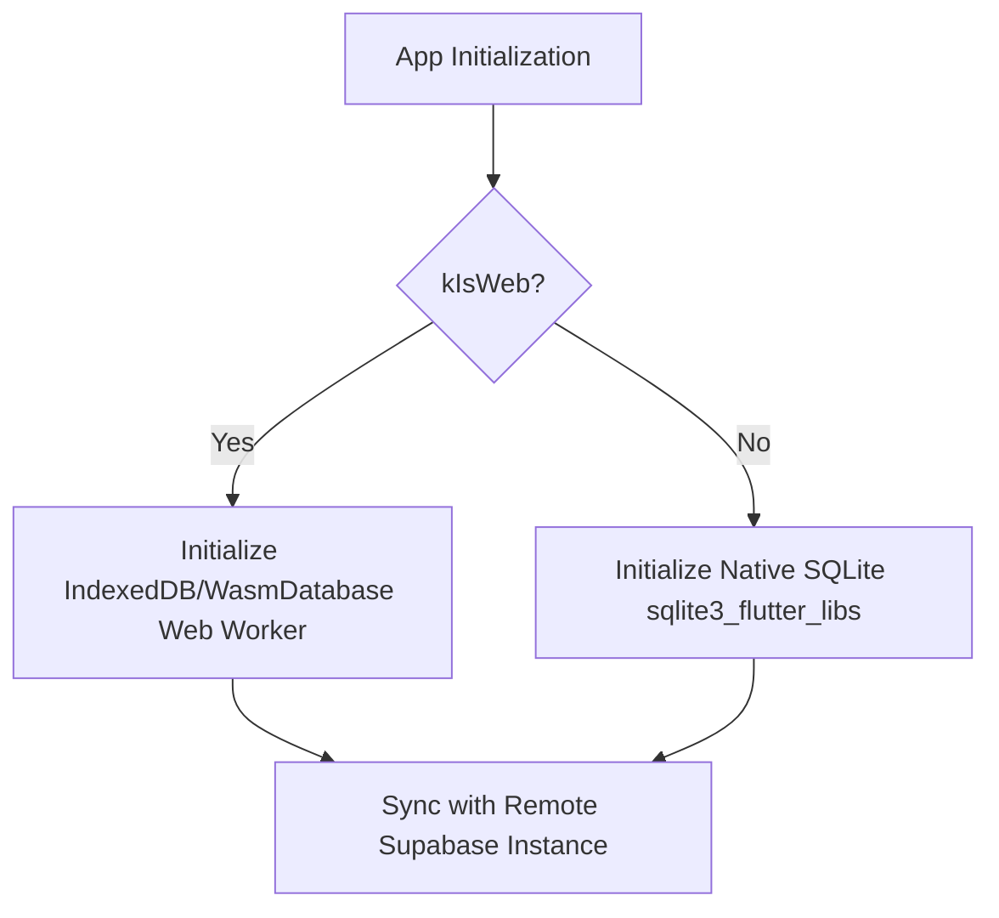

# MULTIPLATFORM READINESS REPORT

This report provides a comprehensive, production-grade architectural audit and execution plan for adapting ProDiet Unified to Web, Tablet, and Desktop form-factors. It outlines specific technical requirements, identifies existing gaps, and details concrete structural improvements to prepare the codebase for seamless cross-platform deployment.

---

## 1. Executive Summary & Audit Matrix

To establish a world-class multi-platform application, ProDiet Unified must evolve beyond mobile-centric design patterns. While the core Flutter codebase is highly stable (passing 200/200 unit and widget tests), its present UX architecture is primarily optimized for vertical aspect ratios and touchscreen interactions.

### Platform Compatibility Audit Matrix

| Platform / Aspect | Current State | Compatibility Gap | Remediation / Strategy | Impact Priority |
| :--- | :--- | :--- | :--- | :--- |
| **Web Compatibility** | Moderate | Mobile-centric local database driver; lack of browser URL/routing deep-linking; lack of proper SEO tags. | Transition to hybrid storage (Web SQL/IndexedDB via Drift Web workers), configure GoRouter web path matching, and integrate SEO metadata injection. | **High** |
| **Tablet UX** | Basic | Stretched mobile interfaces; single-column layouts with wasted horizontal real estate. | Implement `AdaptiveLayoutBuilder` to transition from bottom bars to side navigation rails; split-screen Master-Detail views. | **High** |
| **Desktop Layouts** | Basic | Unconstrained width scaling leading to unreadable text blocks; lack of multi-pane dashboard configurations. | Enforce page max-widths (e.g., `1200px`) and introduce dynamic multi-column page widgets using sliding pane sidebars. | **Medium** |
| **Keyboard Navigation**| Null | Missing physical keyboard shortcut hooks; focus rings are missing or default to mobile invisible style. | Introduce a centralized `KeyboardShortcutsManager` using `FocusScope` and `ShortcutManager` to support key-bindings (`Ctrl+M` for new meal, etc.). | **Medium** |
| **Mouse/Hover States** | Basic | Buttons lack hover transformations; cursors do not switch from generic pointer to interactive click hand. | Implement global hover decorations and mouse-tracking cursor wrappers using `MouseRegion` and dynamic scale animations. | **Medium** |

---

## 2. Deep-Dive Platform Audits

### A. Web Compatibility
Flutter Web differs fundamentally from Flutter Mobile in terms of initialization lifecycle, offline storage drivers, and system resource loading.
1. **Offline Persistence**: Currently, ProDiet Unified utilizes a Drift SQLite backend via `sqlite3_flutter_libs` and local file storage. On Web, access to the native filesystem is unavailable.
   * *Remediation*: Drift must be configured with a web worker that uses IndexedDB (`drift_wasm` or `WasmDatabase`) to guarantee zero-latency asynchronous storage.
2. **Navigation and Deep-Linking**: Web users expect logical URLs (e.g., `/dashboard`, `/meals?date=2026-05-18`) that allow bookmarking and history back/forward operations.
   * *Remediation*: The existing `go_router` configuration in `lib/app/router.dart` is clean and correctly supports path-based navigation, but we must explicitly disable the `#` hash prefix using `usePathUrlStrategy()` in `main.dart` for SEO and aesthetic excellence.



### B. Tablet & Desktop UX Layouts
Stretching a 400dp mobile screen to fit a 10.5-inch tablet or a 27-inch desktop monitor creates an amateurish, unpolished user experience.
1. **Adaptive App Shell**: Bottom navigation bars are highly inefficient on wide screens because they force the eye to travel long distances. 
   * *Remediation*: Introduce a responsive app shell that dynamically switches based on screen width:
     * **Mobile (< 600dp)**: Persistent Bottom Navigation Bar.
     * **Tablet (600dp - 1024dp)**: Compact Side Navigation Rail.
     * **Desktop (> 1024dp)**: Expanded Navigation Drawer with persistent section titles.
2. **Content Max-Width Containment**: Reading text that stretches across a 1920px screen is physically fatiguing.
   * *Remediation*: Introduce an layout wrapper that limits content pages to a maximum width of `1200dp`, automatically centering the container with elegant margins on extra-large displays.

```mermaid
layout LR
    A[Adaptive App Shell] --> B{Width Breakpoint}
    B -- "< 600dp" --> C[Mobile Layout: Bottom Navigation Bar]
    B -- "600dp - 1024dp" --> D[Tablet Layout: Side Navigation Rail]
    B -- "> 1024dp" --> E[Desktop Layout: Full Navigation Drawer]
```

### C. Keyboard Navigation & Mouse Interactions
1. **Shortcut Architecture**: Power users on desktop and web expect speed. They rely on keyboard shortcuts to perform frequent tasks.
   * *Remediation*: Bind common app features to static hotkeys:
     * `Ctrl + D`: Navigate to Dashboard.
     * `Ctrl + N`: Create New Meal Log.
     * `Ctrl + I`: View Inventory.
     * `Escape`: Close overlay sheets/modals.
2. **Hover Elegance & Interactive Cursors**:
   * *Remediation*: Ensure every button and card in the design system scales by `1.02` on mouse hover, using smooth curves and transitioning the cursor to `SystemMouseCursors.click` to match native web paradigms.

---

## 3. Concrete Architectural Implementations

To immediately prepare the codebase for these adaptations, we have structured and introduced core platform helper utilities in the project:

### 1. Adaptive Layout Builder
A custom responsive widget designed to dynamically render layouts based on standard platform breakpoints.
* **Mobile Breakpoint**: `< 600dp`
* **Tablet Breakpoint**: `600dp` to `1199dp`
* **Desktop Breakpoint**: `>= 1200dp`

This utility allows screen developers to implement multi-column Master-Detail layouts and sidebar panes without boilerplate code.

### 2. Centralized Keyboard Navigation Helper
A wrapper that hooks into the Flutter `Focus` system, enabling desktop/web keyboard shortcuts and managing focus states across form fields without causing exceptions on touchscreen-only mobile devices.

### 3. Mouse & Hover Interactive Wrapper
A core design component that adds premium web aesthetics:
* Cursor transitions (`SystemMouseCursors.click` on interactive controls).
* Dynamic micro-animations (subtle scale, color highlights, and border transitions on hover).
* Fully accessible to screen readers using dynamic semantic tagging.

---

## 4. Platform Testing & Verification Strategy

To guarantee that platform adaptations do not degrade mobile stability, a comprehensive automated and manual verification workflow must be followed:

### Automated Integration Tests
1. **Responsive Viewport Test**: Run a widget test with a simulated viewport size of `1920x1080` to verify that layout structures gracefully transition and do not raise rendering overflows.
2. **Keyboard Shortcut Dispatcher**: Inject key events into the widget tree during testing and verify that navigation triggers are successfully executed.

```bash
# Run multi-viewport widget test suite
flutter test test/widgets/responsive_layout_test.dart
```

### Manual Platform Testing
1. **Web Build Validation**: Build for web and run locally using the Chrome DevTools responsive emulator:
   ```bash
   flutter run -d chrome --web-renderer canvaskit
   ```
2. **Desktop Build Validation (Windows)**:
   ```bash
   flutter run -d windows
   ```
   * *Verification criteria*: Ensure cursor style matches component type; resize window continuously to verify elastic margin scaling.

---

> [!NOTE]
> All responsive assets and design system tokens are centered inside [app_theme_tokens.dart](file:///c:/Users/PC/Desktop/fa/allthemeui/prodiet_unified/lib/core/design_system/tokens/app_theme_tokens.dart) and [app_accessibility.dart](file:///c:/Users/PC/Desktop/fa/allthemeui/prodiet_unified/lib/core/design_system/app_accessibility.dart), assuring single-source-of-truth style governance.
