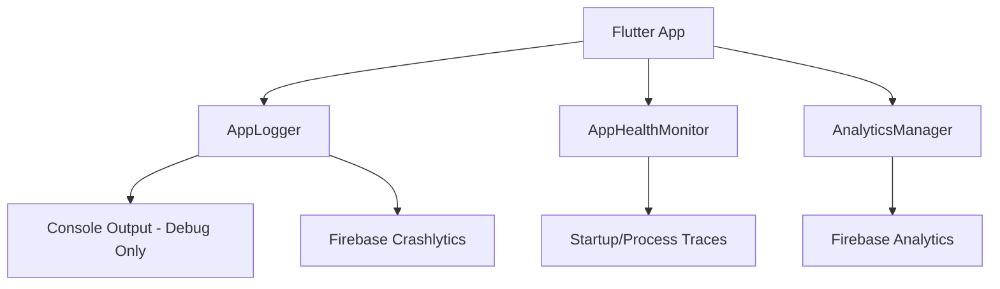

# OBSERVABILITY ARCHITECTURE

ProDiet Unified implements a multi-layered observability system to ensure production reliability, performance monitoring, and rapid diagnostics.

## 1. Architecture

## 2. Components

### AppLogger
- **Role**: Central gateway for all app events, errors, and warnings.
- **Diagnostics**: Automatically attaches severity, logger names, and system state to Crashlytics reports.
- **Hardening**: Global error handler for uncaught exceptions via `PlatformDispatcher`.

### AnalyticsManager
- **Role**: Structured taxonomy implementation for business intelligence.
- **Taxonomy**: `category.action.result` (e.g., `auth.login.success`).
- **Privacy**: User IDs are set only after successful authentication.

### AppHealthMonitor
- **Role**: Performance and stability tracking.
- **Metrics**: 
  - `app_startup`: Total duration from `main()` to first frame.
  - `ocr_processing`: Time spent in cloud-vision extraction.
  - `sync_duration`: Duration of sync queue processing.

### RemoteConfigService
- **Role**: Staged rollouts and emergency controls.
- **Controls**:
  - `feature_ocr_enabled`: Emergency kill-switch for OCR.
  - `sync_interval_seconds`: Dynamic tuning of sync frequency.
  - `app_maintenance_mode`: Global app lockdown.

## 3. Production Guidelines

1. **NO random prints**: Use `AppLogger.debug()` or `AppLogger.info()`.
2. **Error metadata**: Always provide the `error` and `stackTrace` to `AppLogger.error()`.
3. **Trace critical paths**: Use `AppHealthMonitor.startTrace()` for user-visible wait times.
