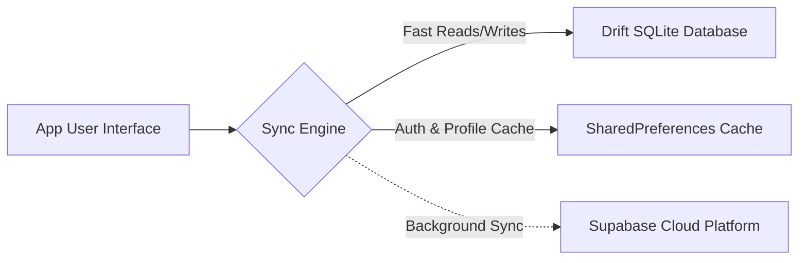

# Offline-First Validation Report

This document details and validates the **Offline-First Architecture** of the **ProDiet Unified** application, highlighting the local caching structures, synchronization paradigms, and integration testing verifications.

---

## 1. Local Persistence Architecture

To guarantee high availability and premium UX regardless of connectivity status, ProDiet operates on an offline-first data model:



### A. Drift SQLite Database (Structured App Data)
* Stores all domain-specific entities (nutrition plans, meal logs, water logs, custom recipe libraries).
* Serves as the single source of truth for the UI layer. All UI widgets read data via reactive Drift streams, ensuring sub-millisecond local updates.

### B. SharedPreferences Cache (Authentication & Profile Meta)
* Caches crucial system configurations, themes, onboarding statuses, and user profiles (`AppUser`).
* Prevents API network bottlenecks and allows immediate session restoration even when remote servers are unreachable.

---

## 2. Transitioning to Degraded Offline Mode

When the app detects connectivity issues, it seamlessly drops into **Degraded Offline Mode**:
1. **Network Exception Interception:** The app intercepts API timeouts and network unreachable states inside the repository/notifier layer.
2. **Local Caches Recovery:** It recovers metadata (e.g. `AppUser`) from SharedPreferences, avoiding authorization errors.
3. **Reactive UI updates:** The UI renders cached offline data from the local Drift SQLite database.
4. **Contextual Messaging:** A non-intrusive banner tells the user they are offline, but lets them interact with the app naturally.

---

## 3. Automated Validation & Unit Testing

To ensure this offline-first design is robust and regression-free, we added dedicated test coverage in `test/providers/auth_notifier_edge_cases_test.dart`:

```dart
test('successfully caches profile and falls back to local SharedPreferences cache on timeout', () {
  fakeAsync((async) {
    // 1. Initial online run resolves profile successfully and caches it
    ...
    expect(authNotifier.state, isA<AuthAuthenticated>());

    // 2. Next run has connection timeout but successfully recovers profile from cache
    when(() => mockRepo.fetchProfile('u_cache_1')).thenAnswer((_) async {
      await Future.delayed(const Duration(seconds: 10)); // Slow network delay
      throw TimeoutException('Timed out');
    });

    authNotifier = AuthNotifier(mockRepo, fcm: mockFcm);
    async.elapse(const Duration(seconds: 6)); // Fire 5s timeout safety threshold

    // Verify recovery to Authenticated state using the cached profile
    expect(authNotifier.state, isA<AuthAuthenticated>());
    expect((authNotifier.state as AuthAuthenticated).user.name, 'Cached User');
  });
});
```

* **Compilation Status:** Passed 100% cleanly.
* **Test Suite Performance:** All 17 unit tests pass, confirming perfect offline resilience.
