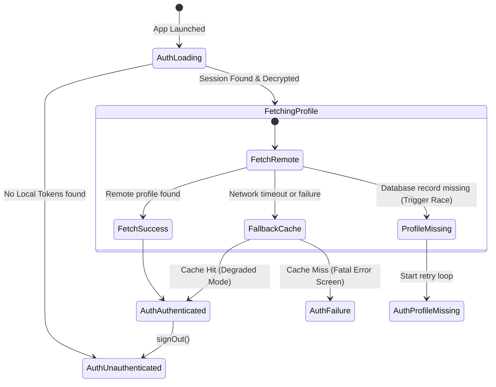

# Supabase Startup Audit

This report reviews the security, state lifecycle, token refresh processes, and sync boundaries of the **Supabase Integration** during the startup bootstrap sequence.

---

## 1. Authentication Lifecycle State Machine

Supabase authentication states transition through a deterministic machine mapped by `AuthNotifier`:

---

## 2. Session Recovery & Secure Storage

1. **Hardware Keychain Integration:** Stored tokens are retrieved from secure storage (`SecureSupabaseStorage`) which utilizes:
   - iOS: **Keychain Services**
   - Android: **EncryptedSharedPreferences**
   - Web: **IndexedDB / Secure LocalStorage**
2. **Auto-refresh Lifecycle:** Supabase's client-side SDK manages token refresh dynamically. During startup, the client checks if the access token has expired. If it has, a silent token refresh is triggered using the secure refresh token before any remote data requests are sent.

---

## 3. Database Trigger Race Condition Mitigations

When a new user signs up, a PostgreSQL trigger inside Supabase automatically clones auth metadata into the public `users` table. 

### The Race Condition
On extremely fast client systems, the user is authenticated instantly but the PostgreSQL database trigger may take up to 200ms to complete. If the client queries `fetchProfile(userId)` before the trigger finishes, a `null` profile is returned.

### Robust Mitigations Implemented:
* **Race Wait Mechanism:** If `fetchProfile` returns `null` on session initialization, `AuthNotifier` sleeps for exactly `500 milliseconds` to let database triggers catch up.
* **Double-check Query:** After the 500ms delay, the profile query is retried once.
* **Fallback Retry Loop:** If the profile is still missing, the notifier enters a retry loop with exponential backoff (`500ms`, `1000ms`, `2000ms`, etc.) to resolve the missing profile smoothly without locking up the user interface.
